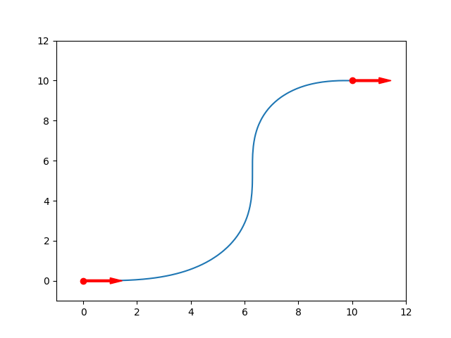

## PolyTraj Documentation
PolyTraj is a C++ trajectory generation library for autonomous vehicle motion planning based on ["Reactive Nonholonomic Trajectory Generation via Parametric Optimal Control"](http://frc.ri.cmu.edu/~alonzo/pubs/papers/ijrr02TrajGen.pdf).



### Installation
1. Install [Eigen](https://eigen.tuxfamily.org/dox/GettingStarted.html).
2. Install [GTest](https://github.com/google/googletest) if you want to run the tests.

```
git clone --recurse-submodules https://github.com/jsford/PolyTraj
cd PolyTraj
mkdir build
cd build
cmake -DCMAKE_BUILD_TYPE=Release -DBUILD_SHARED_LIBS=OFF -DBUILD_EXAMPLES=ON  -DBUILD_TESTS=ON -DBUILD_DOCS=ON ..
make
# sudo make install (Don't do this yet!)
```

### Examples

```
cd PolyTraj/build/examples/
./path_example
./trajectory_example
```

### Tests
cd PolyTraj/build/test/<br>
./run_tests

### Contact
Jordan Ford<br>
[jordan@andrew.cmu.edu](mailto:jordan@andrew.cmu.edu)<br>


